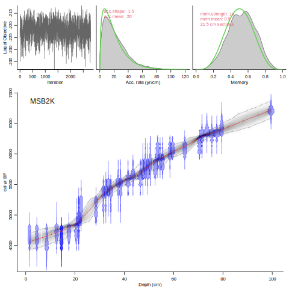

Bacon is an age-depth modelling tool which divides a sediment core up into equally-sized sections of (by default) 5 cm thickness, and assumes a linear accumulation within each section. Accumulation rates can change between the sections, and this variability is constrained by prior information (see below). Bacon can use radiocarbon dates (calibrating them as it runs) or dates that are already on the calendar scale. 

Bacon works through R (or Rstudio), and requires a recent version of R (at least 4.0.1). The first time you are using Bacon on your computer, you will have to install its R package, by typing within the terminal of R:

```{r, eval=FALSE}
install.packages('rbacon')
``` 

To use rbacon, first the package has to be loaded (this will also load its companion package rintcal):

```{r}
library(rbacon)
```

The package comes with two pre-loaded datasets, MSB2K and RLGH3. Start by running the default core, MSB2K. Note R's comments about where the files are going to be placed, as we will need this information later. Press 'y' and/or Enter to accept any suggestions.

```{r, eval=FALSE}
Bacon()
```

Bacon will calibrate any C-14 dates, do the MCMC run, calculate age ranges, produce graphs and provide information about the confidence ranges. The output graph, below, contains a number of panels containing important information (so please don't cut them out for your publications):

* First, at the top left we can see the 'fit' or 'energy' of all MCMC (Markov Chain Monte Carlo) iterations of the run. If the iterations seem clustered with sections of lower and of higher energy, then the run probably didn't go well and you might want to try running your core with more iterations (parameter ssize).

* The second panel at the top shows the accumulation rate (in yr/cm, so actually sedimentation time). The prior (green) is a gamma distribution with two parameters: acc.mean and acc.shape. The values of gamma distributions are always >0, ensuring positive accumulation rates. Larger values of shape will result in more peaked prior distributions. The grey shape shows the posterior distribution.

* Then we have the prior (green) and posterior (grey) for the memory, or how much accumulation rates can change from one depth to the other. This is a beta distribution, which allows values between 0 and 1. A very low memory prior would allow for a high variability of accumulation rate, while a very high memory prior would result in a nearly straight age-depth model. Also shown is the section thickness of the piece-wise linear model, and the resulting amounts of sections.

* If you have set a hiatus, then the rightmost top-panel will show the prior (green) and posterior (grey) distributions for this. The prior for this is a uniform distribution (but always >0; the maximum is set at 10,000 years by default but this can be changed).

* Finally there is the main panel, which shows the distribution of the dates in blue (calibrated C-14 dates) or greenish (cal BP dates). More precise dates will peak higher (on the depth scale) than less precise, wider dates. The age-depth model is shown in grey-scale, where darker hues indicate more certain areas. The red dashed curve shows the mean model, and the dashed grey curves the 95% confidence intervals.
 


Besides the graph, Bacon also produces files containing age estimates (95% ranges and the mean) for each depth (by default every cm from the top to the bottom core depth). This file can be found in the core's folder (see [here](./foldersfiles.html)).

rbacon is open-source software; you are free to use, copy, distribute and modify it, but please do read this tutorial, the help functions and accompanying paper before using the program. This software is distributed under the terms of the GNU General Public Licence. rbacon does not come with any warranty and the authors do not assume any responsibility for the usefulness of any portion of this program. *Do cite this program when modifying or using it, including its version, Blaauw and Christen (2011)[^1], applied settings and calibration curves used.*

Parts of this software remain under construction. Details such as the default settings and behaviour could change between versions, so please check this manual for the latest information. You are most welcome to report bugs, ideas and missing features to Maarten <maarten.blaauw@qub.ac.uk>, Marco <aquino@cimat.mx> or Andrés <jac@cimat.mx>.

***

[contents](./contents.html)
<br>
[next [priors and settings] ->](./priorssettings.html)
<br>

[^2]: Blaauw, M., Christen, J.A., 2011. Flexible paleoclimate age-depth models using an autoregressive gamma process. *Bayesian Analysis* 6, 457-474

