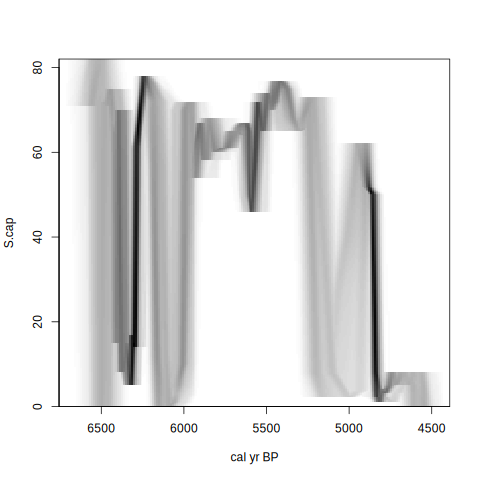
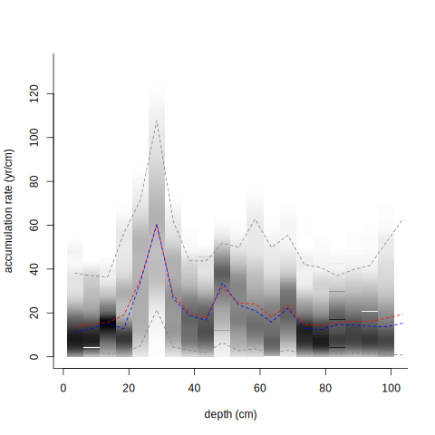
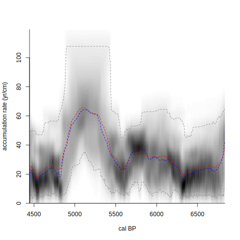

By default, Bacon will perform millions of MCMC iterations for each age-model run, although only a fraction of these will be stored. In most cases the remaining MCMC iterations will be well mixed (the upper left panel of the fit of the iterations shows no strange features such as sudden systematic drops or rises). However if the iterations seem not well mixed, or if too few remain (say less than a few hundred), then you could check the Gelman and Rubin Reduction Factor[^1]. Too high differences (high Factors) between runs indicate poor MCMC mixing. Robust MCMC
mixing is indicated by a Gelman and Rubin Reduction factor below the 1.05 safety threshold.

For example, try the default core, running it five times with a very small sample size of `ssize=100`:

```{r, eval=FALSE}
Baconvergence("MSB2K", thick=5, runs=5, ssize=100, coredir=tempfile())
```

```
 Did 5 Bacon runs.
 Gelman and Rubin Reduction Factor 1.10078680880009 (smaller and closer to 1 is better).
 Probably not a robust MCMC run! Too much difference between runs, above the 1.05 threshold. Increase sample size?
```

### greyscale plots

Once a robust, reliable and realistic age-depth model has been produced, the fun starts. Greyscale plots for example can be used to show not just one age-depth curve but the entire MCMC run output. If pollen or other 'proxies' have been analysed across a range of depths of your core, then these proxies can be plotted on the time-scale as grey-scale 'ghosts' where less certain sections are plotted in lighter grey than more certain sections. Bacon looks for a file in the core's folder, starting with the core's name and ending in `_proxies.csv`, e.g., `Bacon_runs/MSB2K/MSB2K_proxies.csv`. This file should have columns separated by commas, with the first column being the depth, followed by columns for the proxies. The first row should contain the names of the columns. To produce a proxy ghost of the seventh proxy of MSB2K:

```{r, eval=FALSE}
proxy.ghost(7)
```



Ghost graphs can also be produced for the accumulation rate throughout the core (`accrate.depth.ghost`) or over time (`accrate.age.ghost`):

```{r, eval=FALSE}
accrate.depth.ghost()
accrate.age.ghost()
```






### Other analyses

```{r, echo=FALSE, include=FALSE}
require(rbacon)
Bacon("MSB2K", ask=FALSE, coredir=tempdir(), suggest=FALSE)
agedepth()
```

R provides a very versatile environment to query the age-model output. To get the age estimate of any single core depth:

```{r}
Bacon.hist(20)
```

You can also store the iterations of the age estimates of that depth in a new variable and then query it:

```{r}
a.d20 <- Bacon.Age.d(20)
summary(a.d20)
hist(a.d20)
```

Or calculate how much time has passed between 30 and 20 cm depth:

```{r}
a.d30 <- Bacon.Age.d(30)
a.d20 <- Bacon.Age.d(20)
summary(a.d30-a.d20)
hist(a.d30-a.d20)
```

Accumulation rates at specific depths or ages can also be investigated:

```{r}
acc.d20 <- accrate.depth(20)
summary(acc.d20)
acc.a4500 <- accrate.age(4500)
summary(acc.a4500)
```


***

[contents](./contents.html)
<br>
[<- previous [folders and files]](./foldersfiles.html)
<br>
[next [FAQ] ->](./FAQ.html)

[^1]: Brooks, S.P., Gelman, A., 1998. General methods for monitoring convergence of iterative simulations. *Journal of Computational and Graphical Statistics* 7, 434-455
